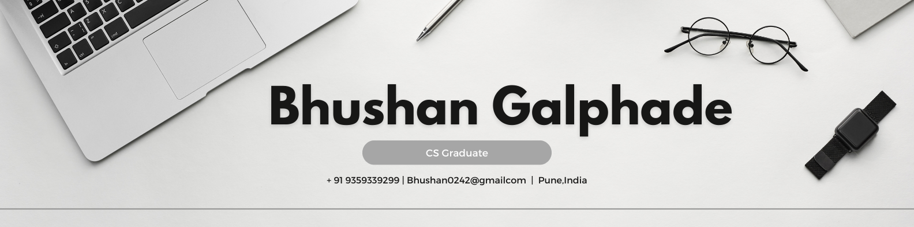

  

###

<h2 align="left">Hi there 👋 I’m Bhushan Galphade, a Java Full Stack Developer.</h2>

###

<h4 align="left">I'm a dedicated Java full stack Developer with a passion for building robust and efficient applications. As a fresher, I’m eager to apply my knowledge of Java, object-oriented programming, and software development principles to real-world projects.</h4>

###

  
  
  
  
  
  
  
  
  
  
  
  
  
  
  
  
  
  
 

   
  
  
  
  

###

  
  

###

  

###
